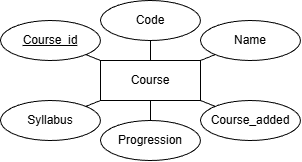

# lab-1 i kursen Backend-baserad webbutveckling, DT207G

Länk till applikationen:

**Genomförd av joha2102**

Skapa en webbapplikation som tillåter användare att lagra och visa kurser de har läst. Använd Node.js och Express för att skapa servern och ansluta till en relationsdatabas för att lagra kursinformation.

Data ska lagras i valifri relationsdatabas, som exempelvis SQLite eller MySQL/MariaDb.

## ER-diagram

Basrelationer: Course (Course_id (pk), Code, Name, Syllabus, Progression, Course_added)